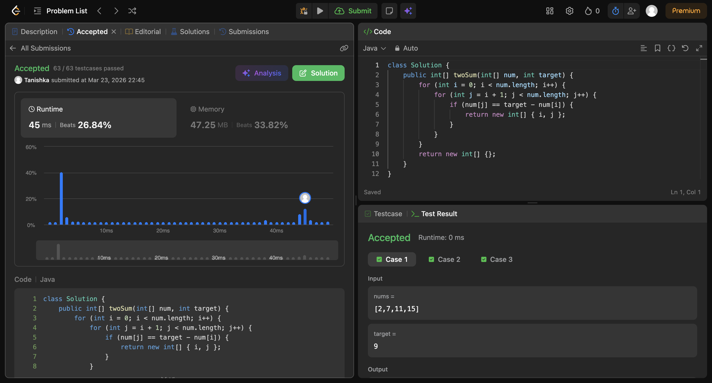

# Two Sum Problem

## Screenshot


## Code

```java
class Solution {
    public int[] twoSum(int[] num, int target) {
        for (int i = 0; i < num.length; i++) {
            for (int j = i + 1; j < num.length; j++) {
                if (num[j] == target - num[i]) {
                    return new int[] { i, j };
                }
            }
        }
        return new int[] {};
    }
}