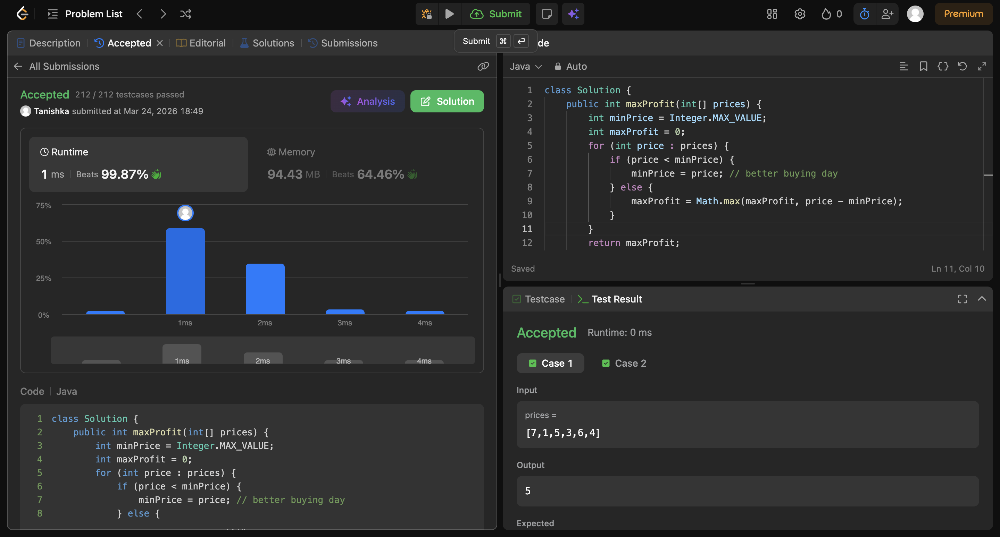

# Best time to buy and sell

## Screenshot


## Code

```java
class Solution {
    public int maxProfit(int[] prices) {
        int minPrice = Integer.MAX_VALUE;
        int maxProfit = 0;
        for (int price : prices) {
            if (price < minPrice) {
                minPrice = price; // better buying day
            } else {
                maxProfit = Math.max(maxProfit, price - minPrice);
            }
        }
        return maxProfit;
    }
}