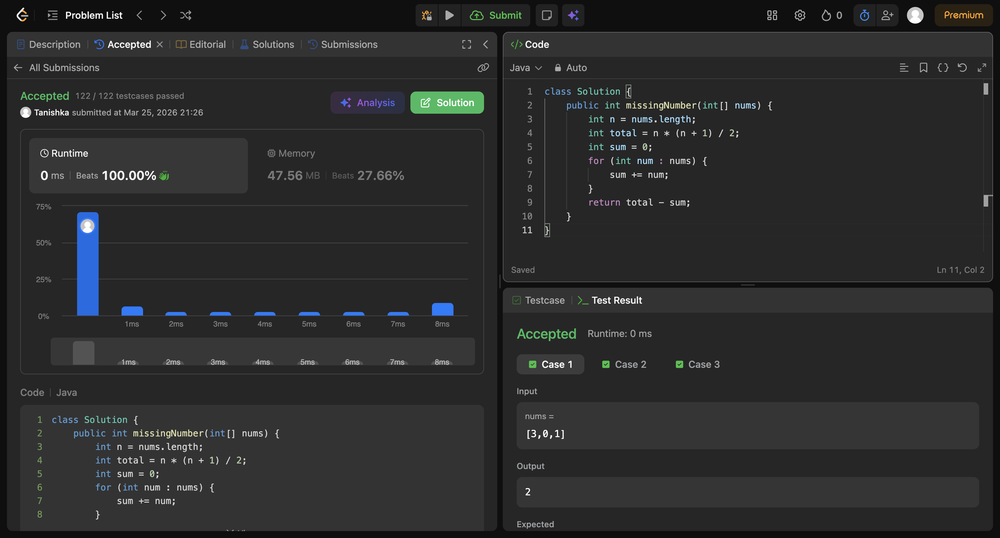

# Missing Number

## Screenshot


## Code

```java
class Solution {
    public int missingNumber(int[] nums) {
        int n = nums.length;
        int total = n * (n + 1) / 2;
        int sum = 0;
        for (int num : nums) {
            sum += num;
        }
        return total - sum;
    }
}