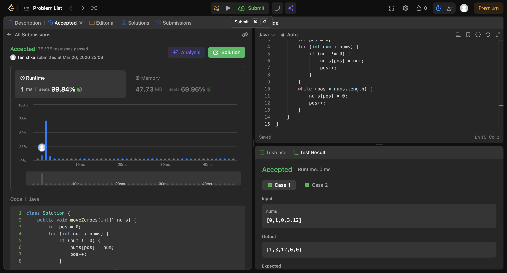

# Move Zeroes

## Screenshot


## Code

```java
class Solution {
    public void moveZeroes(int[] nums) {
        int pos = 0;
        for (int num : nums) {
            if (num != 0) {
                nums[pos] = num;
                pos++;
            }
        }
        while (pos < nums.length) {
            nums[pos] = 0;
            pos++;
        }
    }
}