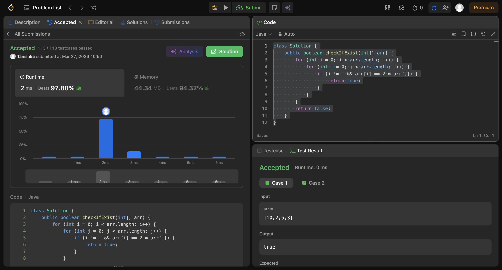

# N and its double

## Screenshot


## Code

```java
class Solution {
    public boolean checkIfExist(int[] arr) {
        for (int i = 0; i < arr.length; i++) {
            for (int j = 0; j < arr.length; j++) {
                if (i != j && arr[i] == 2 * arr[j]) {
                    return true;
                }
            }
        }
        return false;
    }
}